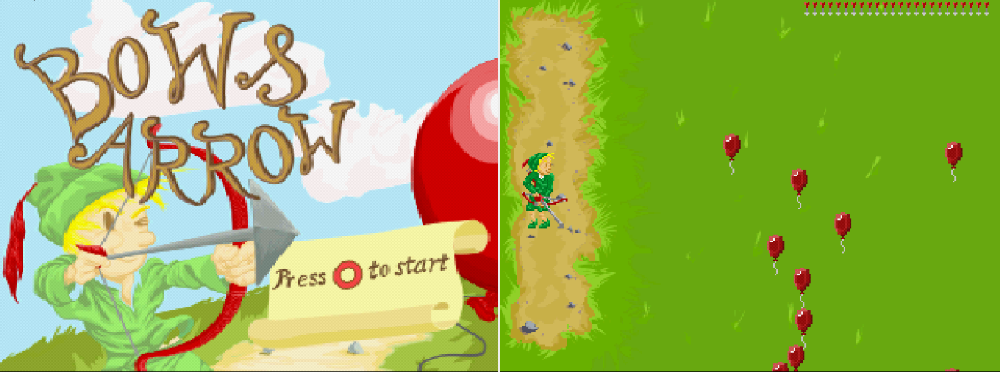

# Bow & Arrow PSX

Base on the original dos game by John Di Troia, From Bow and Arrow - In Search of the Greatest Archer v1.0 (1992)
https://www.classicdosgames.com/company/johnditroia.html

**WARNING : The following code is *TERRIBLE*, I am learning C, thus the terrible quality. But it does the job ¯\_(ツ)_/¯ and I had FUN**

Graphics are homemade with the awesome [Aseprite](https://github.com/aseprite/aseprite/) software.

# Compiling

This project uses [Nugget+PsyQ](https://github.com/ABelliqueux/nolibgs_hello_worlds#setting-up-the-sdk--modern-gcc--psyq-aka-nuggetpsyq).

Git clone the project in the pcsx-redux folder : `(...)/pcsx-redux/src/mips/`,then in a terminal, just type `make` to build the ps-exe.

# Credits !

## Sound effects :

ready       ©2020 Fesliyan Studios Inc. - https://www.fesliyanstudios.com/play-mp3/4937  
pop         Myinstants - https://www.myinstants.com/instant/pop/?utm_source=copy&utm_medium=share  
jump        2873.mp3 http://www.universal-soundbank.com/  
shtoc        2873.mp3 http://www.universal-soundbank.com/  
shoot       ©2020 Fesliyan Studios Inc. - https://www.fesliyanstudios.com/play-mp3/7742  

## Music :

Folk Round by Kevin MacLeod  
Link: https://incompetech.filmmusic.io/song/3770-folk-round  
License: http://creativecommons.org/licenses/by/4.0/  

Village Consort by Kevin MacLeod  
Link: https://incompetech.filmmusic.io/song/4585-village-consort  
License: http://creativecommons.org/licenses/by/4.0/  

Crowd Hammer by Kevin MacLeod  
Link: https://incompetech.filmmusic.io/song/4983-crowd-hammer  
License: http://creativecommons.org/licenses/by/4.0/  

## Font for the unused You Won, You Lost messages:

EB Garamond, by Georg Duffner : http://www.georgduffner.at/ebgaramond/index.html,   
license : https://scripts.sil.org/cms/scripts/page.php?site_id=nrsi&id=OFL

## Help 

Big thanks to the psxdev community at psxdev.net, and on the discord for their help and company, including but not limited to:

@NicolasNoble, @Jabby smoll seamonstah, @Lameguy64, @NDR008, @Sickle, @Paul...
